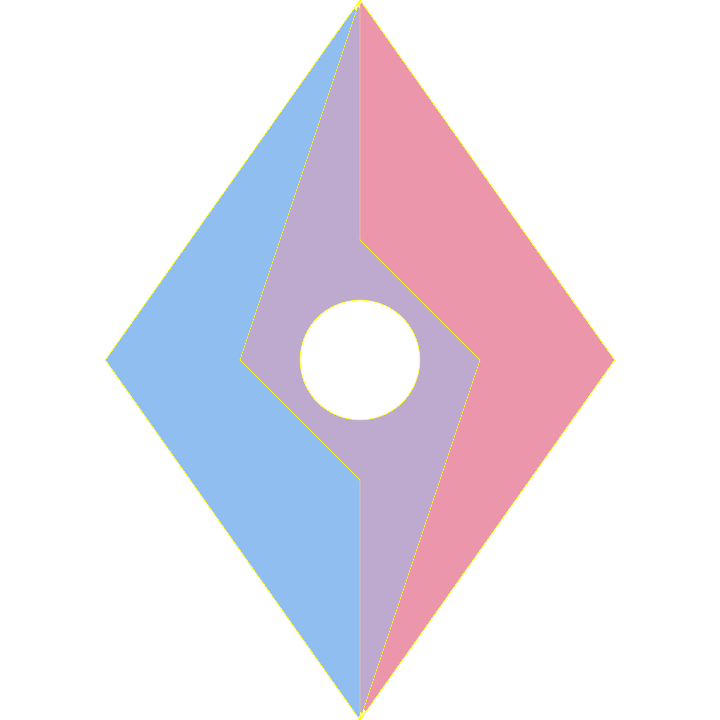

<h1 align="center">
  
  <br>Raiden<br>
</h1>

<h4 align="center">Re:Zero - Develop a Video Website.</h4>

<p align="center">
  
  KT-beaace">
  
</p>

## About

The name is come from my favorite game character: Raiden EI.

## Features

- Social Networking
  - User
  - Message
  - Feed
- Contribute
  - Article
  - Video
- Live
- Internal
  - File Storge
  - Media Process
  - Audit

## Getting Started
Update config files in every app configs folder, configs include: mysql dsn, external api host, etc. and then
  
```shell
make docker-compose
```

## License

This software is released under the MIT license.